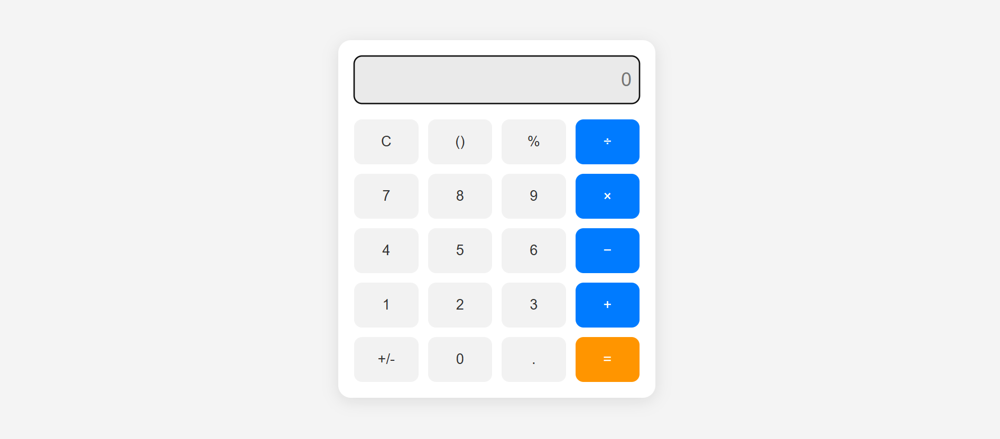

# Smart Responsive Calculator

A responsive calculator with keyboard support using HTML, CSS & JS.  
Built for mobile, tablet, and desktop with full event handling and clean UI.

---

## Features

- Responsive layout for all screen sizes
- Keyboard support (`Enter`, `Backspace`, `Escape`, numbers, operators)
- Supports: +, −, ×, ÷, %, (), +/−, ., =
- Clean, mobile-style UI
- Built with Flexbox and vanilla JavaScript

---

## Tech Stack

- HTML5  
- CSS3 (Flexbox/Grid)  
- JavaScript (ES6)

---

## Screenshot

---

## Live Demo

[View on GitHub Pages](https://kotanarayanareddy.github.io/smart-responsive-calculator)
